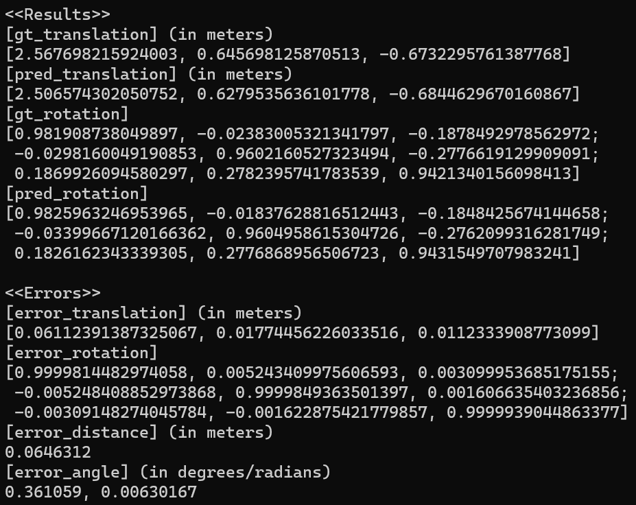

# 3DLiDAR-Camera_Calibration

## Introduction
This is an example for testing an offline 3D LiDAR-camera extrinsic calibration, based on an orthogonal trihedral target with a checkered pattern on each plane.
It is implemented using OpenCV 4.6.0. __Please refer to OpenCV installation and settings [here](https://opencv.org/).__  
The synthetic data was generated using Blensor. The Blensor is a free open-source simulation package for LIDAR/LADAR and Kinect sensors.
__The simulation is available [here](https://www.blensor.org/)__.  

## Examples
There are four examples in `tester.h`:  
`testBlensor()`, `findCameraIntrinsicInReal()`, `calibrateInReal()`, `calibrateInReal2()`.

### Test on synthetic data
In `testBlensor()`, the accuracy of the estimated pose is evaluated by comparing it to the ground-truth pose.   
The test results for "pointcloud_noisy_positional_0.07.pcd" are below.  
1. __Pose estimation and error results__  
  
1. __Input image and point cloud__  
  
  
1. __Relative pose accuracy verification__  
Each corresponding color of the point cloud is obtained from the image and represented as 3D points in the LiDAR coordinates.  
  
The point cloud is projected from LiDAR coordinates to image coordinates and overlaid with the image.
3D points on the target are classified into three planes by the estimated LiDAR pose.
It is represented in RGB colors.  
  

### Camera calibration
`findCameraIntrinsicInReal()` is an example of camera calibration.  
1. __Camera intrinsic and distortion parameters__  
  

### Test on Real-world data
In `calibrateInReal()`, the 3D LiDAR-camera extrinsic calibration is tested in a real environment.   
1. __The estimated relative pose (LiDAR-to-Camera)__  
  
1. __Input image and point cloud__  
  
  
1. __Relative pose verification__  
Each corresponding color of the point cloud is obtained from the image and represented as 3D points in the LiDAR coordinates.  
  
The point cloud is projected from LiDAR coordinates to image coordinates and overlaid with the image.
3D points on the target are classified into three planes by the estimated LiDAR pose.
It is represented in RGB colors.  
  
In the image below, the point cloud is colored according to distance.  
  
1. __Colorization problem__  
As the point cloud is rotated by relative pose, some 3D points overlap in the image coordinates.
The blue points in the image on the left below actually represent a greater distance than the green points.
In other words, the blue points should actually be colored with the color of the wall behind the box,
but since the color behind the box cannot be seen in the image, it is colored with the color of the box.
This problem arises from the colorization algorithm.  
  

### Manual selection of relative pose
Our calibration method automatically selects the relative pose with the smallest rotation angle among the three possibilities.
For LiDAR-camera integrations with a large relative rotation angle, manual selection is required.  
For example, `calibrateInReal2()` assumes the camera is mounted upside down. In other words, the input image is rotated 180 degrees around the camera's principal axis.  
1. __Input image__  
  
1. __The relative pose with the smallest rotation angle__  
The coordinate axes are correctly aligned with the target, but taking the image and point cloud into account, we can see that this result is incorrect.  
  
  
1. __Second relative pose for manual selection__  
  
  
1. __Third relative pose for manual selection__  
  
  
1. __Conclusion__  
Checkered patterns of three different sizes enable the camera to identify the three planes.
Using a target with different plane sizes allows LiDAR to identify the three planes.
However, these conditions require the sensor to fully observe the target.
We think that this preparation made the use of the algorithm complex and cumbersome.  
In our method, if possible, we recommend choosing a sufficiently large target and placing it close to the sensors.
It doesn’t matter if the target is not fully observed in LiDAR’s FoV.
Observation of many points leads to more accurate results.  
The result below shows that the algorithm works even though only some points on the target are used.  
  
  

